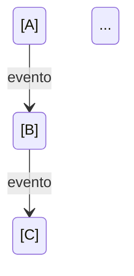

# Plantilla para RAG_DOMAIN_RULES

Usar este esquema al generar las reglas de dominio para RAG. Sustituir los placeholders por el contenido extraído del código. Incluir siempre el frontmatter según RAG_FRONTMATTER_DOMAIN_RULES.md. Todas las secciones listadas son obligatorias.

---

```yaml
---
rag_document_type: domain_rules
project_name: "<NOMBRE_PROYECTO>"
scope: "<ruta analizada, ej. packages/admin>"
title: "<título legible, ej. Reglas de dominio del proyecto Admin>"
generated_at: "<ISO8601 opcional>"
# segment: "<opcional si es segmento>"
---
```

# Reglas de Dominio – [Nombre del proyecto]

> Documento generado para RAG a partir del análisis de `scope`. Sintetiza la lógica de negocio: reglas núcleo, prioridades, casos borde, excepciones, ejemplos, matrices de estado, validaciones e impacto regulatorio.

---

## 1. Reglas núcleo

Expresar la lógica principal del negocio en formato **"Si [condición], entonces [acción/resultado]"**.

| ID | Regla | Origen (archivo / módulo) |
|----|-------|---------------------------|
| R1 | Si [condición], entonces [acción/resultado]. | … |
| R2 | Si … | … |

*(Listar todas las reglas núcleo extraídas del código.)*

---

## 2. Prioridad de reglas

Definir qué regla gana o prevalece en caso de conflictos lógicos.

- [Ejemplo: "Un descuento corporativo prevalece sobre un descuento por suscripción."]
- [Orden de aplicación cuando varias reglas aplican.]
- [Referencias a código donde se resuelve el conflicto.]

---

## 3. Casos borde

Describir cómo se manejan situaciones inusuales o fallos perdonables.

| Caso | Comportamiento | Dónde se maneja |
|------|----------------|-----------------|
| Valores nulos en campo X | … | … |
| Registros duplicados | … | … |
| Eventos out-of-order | … | … |
| Expiración de tokens / sesiones | … | … |
| … | … | … |

---

## 4. Excepciones permitidas

Detallar en qué situaciones está permitido romper una regla general y qué rol o proceso lo autoriza.

| Regla afectada | Excepción | Rol / proceso que autoriza |
|----------------|-----------|----------------------------|
| … | … | super_admin / proceso Y |
| … | … | … |

---

## 5. Ejemplos reales

Casos prácticos extraídos del código en formato `input → output esperado`.

| Ejemplo | Input | Output esperado | Ubicación en código |
|---------|-------|-----------------|---------------------|
| … | … | … | … |

---

## 6. Matriz de estados

Documentar los ciclos de vida importantes (ej: estado de una orden, de un usuario, de un pago). Hacer explícitas las **transiciones válidas** e **inválidas**.

### [Entidad / flujo 1]

- **Estados posibles:** [lista]
- **Transiciones válidas:** [de estado A a B, B a C, …]
- **Transiciones inválidas:** [ej: no se puede pasar de C a A]

Diagrama (Mermaid o tabla):



*(Repetir por cada entidad con ciclo de vida relevante.)*

---

## 7. Validaciones obligatorias

Pre-condiciones y post-condiciones de las funciones principales (operaciones de negocio críticas).

| Función / operación | Pre-condiciones | Post-condiciones |
|---------------------|-----------------|------------------|
| … | Qué debe cumplirse antes de ejecutar | Qué se garantiza después |
| … | … | … |

---

## 8. Impacto regulatorio

Identificar distinciones basadas en regulaciones: reglas por país, canal comercial o segmento de clientes.

| Área | Regulación / criterio | Comportamiento en código |
|------|------------------------|--------------------------|
| Privacidad / GDPR | … | … |
| Bloqueos regionales | … | … |
| Canal / segmento | … | … |

---

*Fin del documento. Si se usan segmentos (ej. RAG_DOMAIN_RULES_orders.md), cada segmento debe incluir las secciones aplicables a ese flujo/dominio con la misma estructura.*
